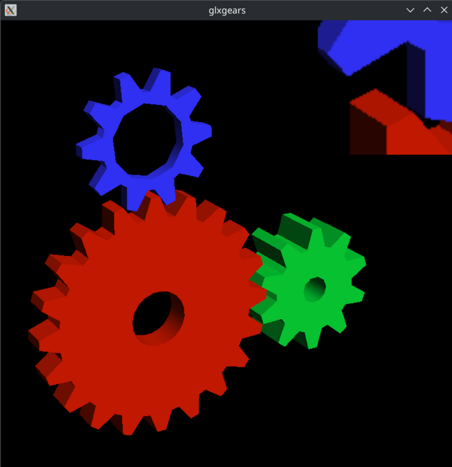

# OpenGL Inject

This project demonstrates how to inject OpenGL rendering into existing applications using LD_PRELOAD. It allows you to modify the rendering pipeline of OpenGL applications without changing their source code.

You can modify the fragment shader by editing the `fragment.shader` file.



## Build and run

To compile and run the project, use the provided script:

```bash
$ cd OpenGL_inject
$ ./compile_and_run.sh
```

Required tools/libraries/packages:
- `g++`
- x11 development libraries
- OpenGL development libraries
- Xrandr development libraries
- Xi development libraries
- `ld` (linker)
- mesa utils / glxgears

The list might be incomplete.

For now glxgears is the only tested application.

# Benchmarks

## Without LD_PRELOAD

```bash
__GL_SYNC_TO_VBLANK=0 vblank_mode=0 glxgears
158580 frames in 5.0 seconds = 31715.842 FPS
159663 frames in 5.0 seconds = 31932.600 FPS
159910 frames in 5.0 seconds = 31981.918 FPS
154489 frames in 5.0 seconds = 30897.789 FPS
```

## With LD_PRELOAD

### First version (no shader)

```bash
./compile_and_run.sh  # with gcc -fPIC -lglfw -lGL -lX11 -lpthread -lXrandr -lXi -ldl --shared -o ogl_inject.so lib.c
Try to load glAttachShader...
"glAttachShader" loaded: 0x7fd45a8f83c0
Try to load glCreateProgram...
"glCreateProgram" loaded: 0x7fd45a8fb580
Try to load glCompileShader...
"glCompileShader" loaded: 0x7fd45a8fa840
Try to load glCreateShader...
"glCreateShader" loaded: 0x7fd45a8fb660
Try to load glGetProgramiv...
"glGetProgramiv" loaded: 0x7fd45a901040
Try to load glGetProgramInfoLog...
"glGetProgramInfoLog" loaded: 0x7fd45a900d20
Try to load glGetShaderiv...
"glGetShaderiv" loaded: 0x7fd45a901540
Try to load glGetShaderInfoLog...
"glGetShaderInfoLog" loaded: 0x7fd45a9014c0
Try to load glLinkProgram...
"glLinkProgram" loaded: 0x7fd45a903de0
Try to load glShaderSource...
"glShaderSource" loaded: 0x7fd45a90af20
Try to load glUseProgram...
"glUseProgram" loaded: 0x7fd45a90e5a0
144668 frames in 5.0 seconds = 28933.479 FPS
146462 frames in 5.0 seconds = 29292.250 FPS
147036 frames in 5.0 seconds = 29407.119 FPS
146011 frames in 5.0 seconds = 29201.236 FPS
```

### With shaders and -02

```bash
./compile_and_run.sh
Load glAttachShader: 0x7fc86ba503c0
Load glCreateProgram: 0x7fc86ba53580
Load glCompileShader: 0x7fc86ba52840
Load glCreateShader: 0x7fc86ba53660
Load glGetProgramiv: 0x7fc86ba59040
Load glGetProgramInfoLog: 0x7fc86ba58d20
Load glGetShaderiv: 0x7fc86ba59540
Load glGetShaderInfoLog: 0x7fc86ba594c0
Load glGetUniformLocation: 0x7fc86ba59ea0
Load glLinkProgram: 0x7fc86ba5bde0
Load glShaderSource: 0x7fc86ba62f20
Load glUniform1i: 0x7fc86ba65560
Load glUseProgram: 0x7fc86ba665a0
Load original glXSwapBuffers: 0x7fc86ba4ecb0
Fragment shader created: 1
Fragment shader compiled successfully.
Creating texture with size 300x300
103841 frames in 5.0 seconds = 20768.158 FPS
105598 frames in 5.0 seconds = 21119.492 FPS
105854 frames in 5.0 seconds = 21170.758 FPS
105747 frames in 5.0 seconds = 21149.234 FPS
```

## With LD_PRELOAD and -O2 optimization

```bash
./compile_and_run.sh
Load glAttachShader: 0x7fd59db483c0
Load glCreateProgram: 0x7fd59db4b580
Load glCompileShader: 0x7fd59db4a840
Load glCreateShader: 0x7fd59db4b660
Load glGetProgramiv: 0x7fd59db51040
Load glGetProgramInfoLog: 0x7fd59db50d20
Load glGetShaderiv: 0x7fd59db51540
Load glGetShaderInfoLog: 0x7fd59db514c0
Load glLinkProgram: 0x7fd59db53de0
Load glShaderSource: 0x7fd59db5af20
Load glUseProgram: 0x7fd59db5e5a0
145307 frames in 5.0 seconds = 29061.289 FPS
146380 frames in 5.0 seconds = 29275.883 FPS
134868 frames in 5.0 seconds = 26973.420 FPS
143137 frames in 5.0 seconds = 28625.543 FPS
Terminated
```

# License
This project is licensed under the MIT License. See the LICENSE file for details.
